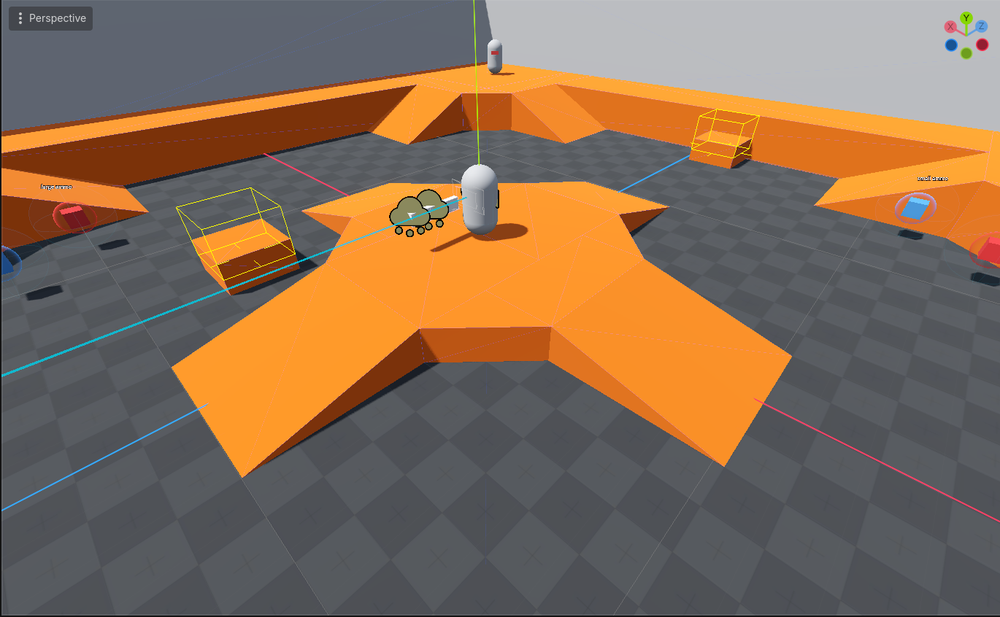
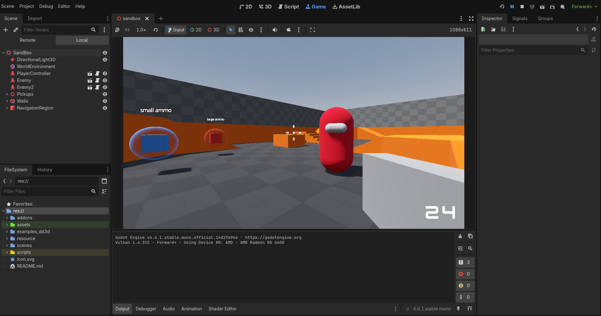

# RoboBlast

A 3D FPS game built with Godot Engine

## Overview

Robo Blast is a fast-paced 3D shooter featuring dynamic weapon systems, enemy AI, and explosive gameplay mechanics. The project serves as both a learning exercise and a personal take on a tutorial from GameDev.TV .

## Features

- **Multiple weapon types** — Automatic, manual, hitscan, and energy weapons
- **Dynamic ammo system** — Pickup-based ammo management
- **Enemy AI** — Responsive enemy behavior and combat
- **Weapon strategies** — Automatic and manual firing strategies
- **Polish effects** — Muzzle flashes, particle effects, and screen shake
- **UI system** — Game over menus, ammo displays, and status indicators

## Requirements

- **Godot Engine** v4.6.1
- **Plugins:**
  - [Debug Draw 3D](https://github.com/DmitriySalnikov/godot_debug_draw_3d) — For debug visualization

## Current Status

Actively developed as a learning project. Features are being refined and expanded.

## Credits

Built following [GameDev.tv's Godot3D course](https://gamedev.tv/courses/godot-complete-3d) by Bramwell Williams, with custom modifications and expansions.

## Notes

There is a **C#** branch of the project that is a one for one conversion but at the momment godot wont render the exports so looking into fixing that.